## Authors

- [@NgoDuc25](https://github.com/NgoMinhDuc25)
- [@MyMainGithubProfile](https://github.com/NgoDuc2505)

## Compile and run script

Run testbench and verilog module file
```bash
iverilog -o [out_file_name] [verilog_module.v] [testbench.v]
```
Run result test and generate .vcd file
```bash
vvp [out_file_name]    
```
Run gtkwave
```bash
gtkwave [out_vcd_file]  
```


## dff_and_mux

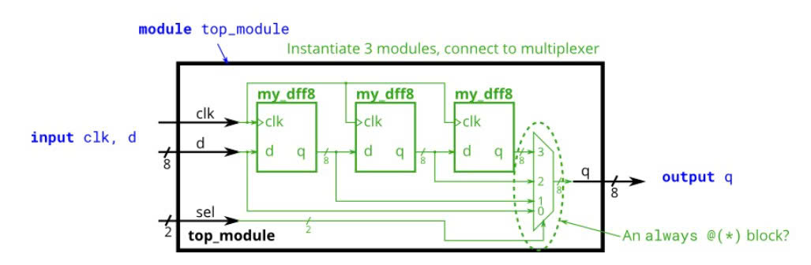

## Add 16 

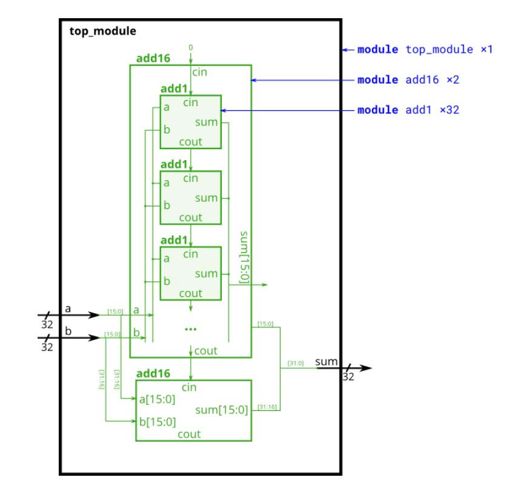

## Binary decoder 

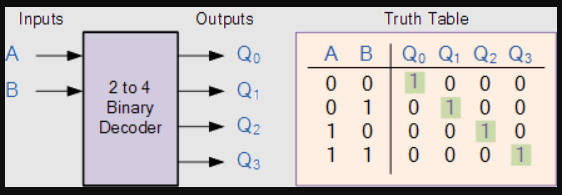

## 4 to 2 priority encoder 

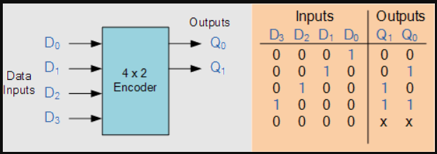

## 8 to 3 priority encoder 

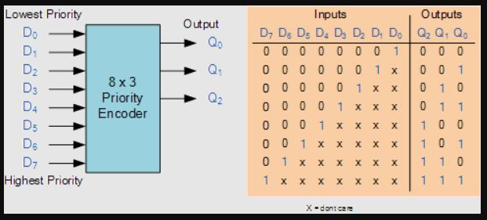

## 4 bit comparator from 2 bit comparator

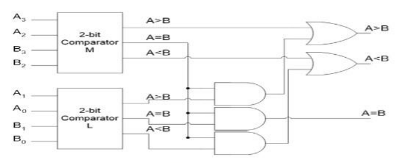

## 7 segment anode decoder

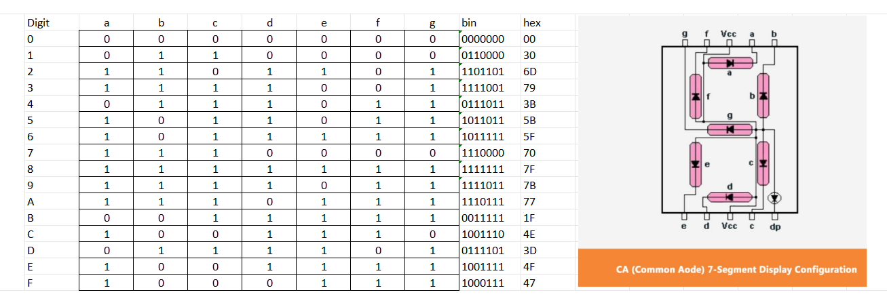

## Traffic light

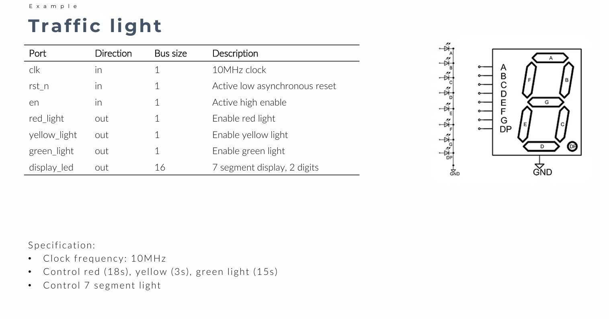

## Traffic light wave monitor

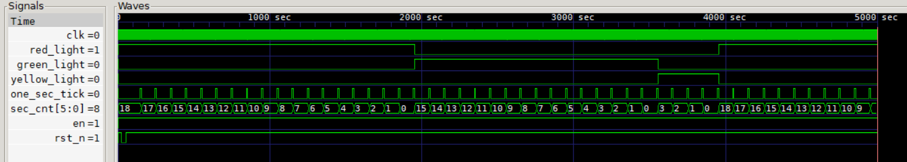
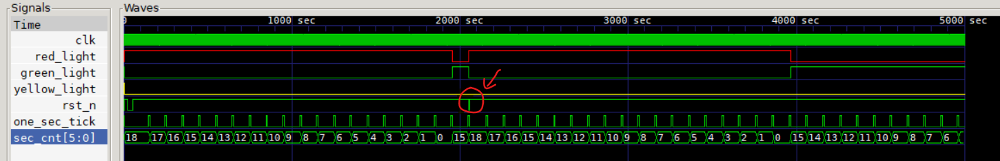
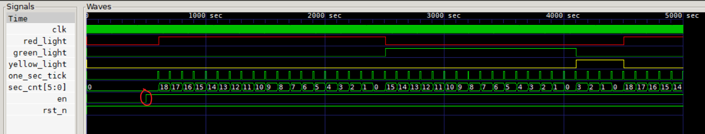

## Summary

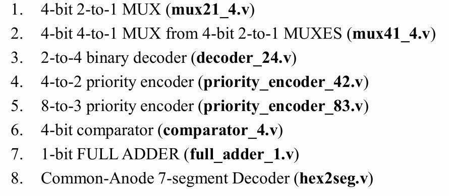